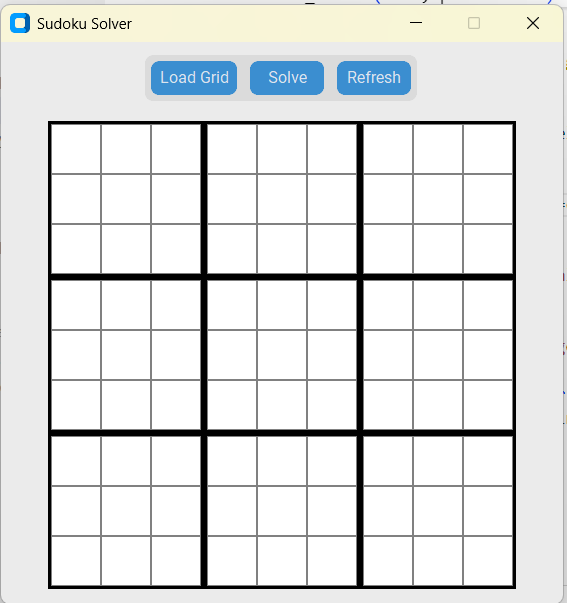
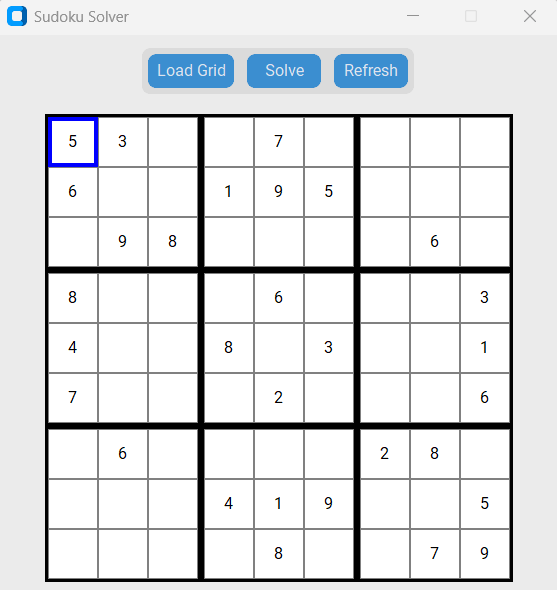
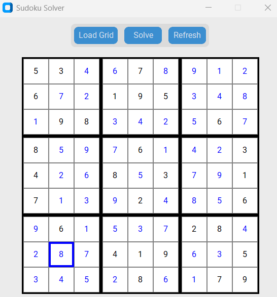
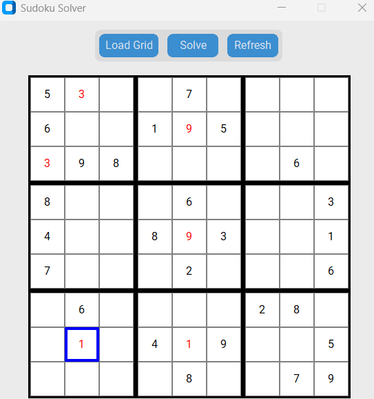
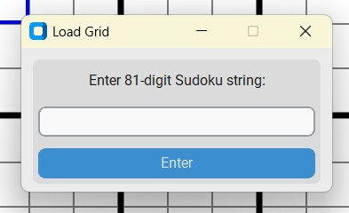
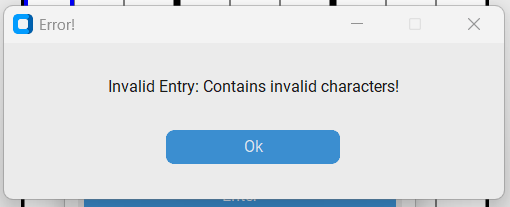

# Sudoku Solver
This is my attempt at producing a sudoku solver application. 
## Project Structure
```
├── README.md
├── src
│   ├── app.py
│   ├── frame.py
│   ├── utils.py
│   ├── window.py
├── test
│   ├── test.py
├── dist
│   ├── app.exe
├── .venv
├── .vscode
│   ├── settings.json
├── .env
├── requirements.txt
└── .gitignore
```
### Running the application
**(.venv) requirements:** customtkinter==5.2.2  
**.env:** PYTHONPATH=./src  
**.vscode/settings.json:**
{
  "python.envFile": "${workspaceFolder}/.env"
}

**Run:**  
--*app.py*  
--*dist/app.exe*
 
## Application Interface
  
*Main Interface*  

  
*Sudoku grid filled*  

  
*Solved sudoku grid*

  
*Invalid sudoku grid (invalid squares are highlighted)*  

  
*Loading a grid with a string*  

  
*Error Message from entering invalid string*  